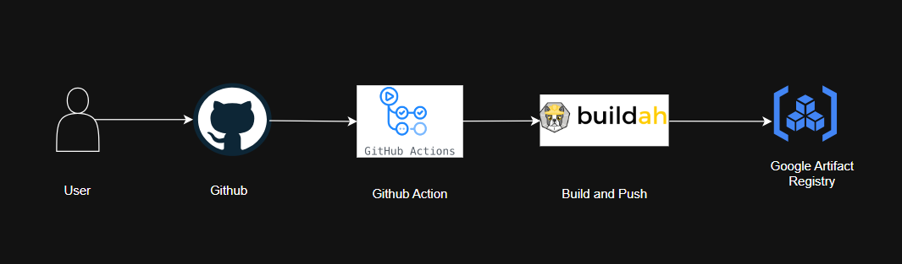

# capstone-containerization

This repo demonstrate use of Buildah Tool to build an OCI Compliant Image using MultiStage Image Build Strategy  and push to Google Artifact Registry.

Buildah Tool is a daemonless tool thus removing the need for Docker daemon solving the Single point of failure scenario that usually the case of Docker.

### Tools:

- IaC: Terraform
- Programming Language: Python 
- Build OCI Image: Buildah
- CI/CD: Github Actions
- OCI Image Registry: Google Artifact Registry

### Security:

- The Github Actions use GCP Workload Identity Federation for GCP Authentication.

### HLD:

### Results:

